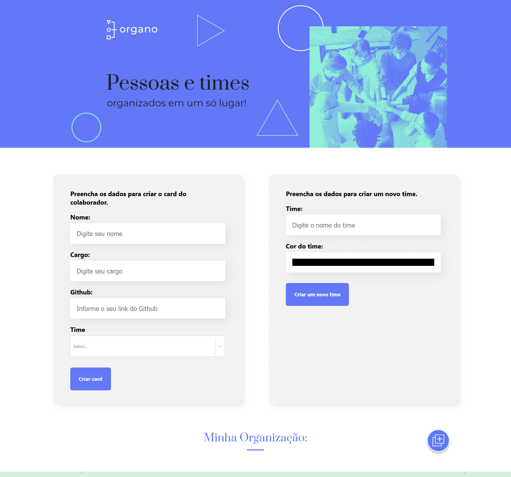

# Projeto Organo - Pessoas e Times - React & Typescript



## Menu

- [Layout](#layout)
- [Descrição](#descrição)
  - [Principais recursos incluem](#principais-recursos-incluem)
  - [Proximos passos de desenvolvimento](#proximos-passos-de-desenvolvimento)
- [Tecnologias Utilizadas](#tecnologias-utilizadas)
- [Estrutura de Pastas](#estrutura-de-pastas)
  - [Arquivos Principais](#arquivos-principais)
- [Como Instalar e Rodar o Projeto](#como-instalar-e-rodar-o-projeto)
  - [Configuração](#configuração)
  - [Casos de Uso Comuns](#casos-de-uso-comuns)
  - [Solução de Problemas](#solução-de-problemas)
- [Projeto ao Vivo](#projeto-ao-vivo)
- [Fluxo de Dados](#fluxo-de-dados)
- [Licença](#licença)
- [Autor](#autor)

## Layout

[Layout no Figma](<https://www.figma.com/design/THdd84v1UUyQpYj99c5XPf/React%253A-desenvolvendo-com-JavaScript-%7C-Organo-(Community)>)

## Descrição

Este projeto é uma aplicação React para gerenciar equipes e colaboradores dentro de uma organização.

A aplicação permite aos usuários criar e gerenciar equipes, adicionar colaboradores a essas equipes e visualizar a estrutura da organização. Ela fornece uma interface amigável para adicionar novos membros da equipe, criar novas equipes e personalizar as cores das equipes.

Este projeto ainda está em desenvolvimento para melhorias.

### Principais recursos incluem:

- Criação e gerenciamento dinâmico de equipes
- Perfis de colaboradores com funcionalidade de favoritos
- Seções de equipes com códigos de cores
- Design responsivo para vários tamanhos de tela
- Alternância de formulários para melhor experiência do usuário

### Proximos passos de desenvolvimento

- Criar possibilidade de um Colaborador pertencer a mais de um time;
- Criar possibilidade de edição para trocar membros de times;

## Tecnologias Utilizadas

- **React.JS:** Biblioteca JavaScript para a construção de interfaces de usuário.
- **CSS:** Utilizado para a estilização dos componentes e layout da aplicação.
- **JavaScript:** Linguagem de programação utilizada no desenvolvimento da lógica da aplicação.
- **useState:** Hook do React.JS utilizado para gerenciar o estado dos componentes.
- **useEffect:** Hook do React.JS utilizado para realizar o fetch da API.
- **react-icons:** Biblioteca para inclusão de ícones no projeto.
- **react-select:** Componente de seleção customizável para React.
- **uuid:** Biblioteca para geração de identificadores únicos.
- **hex-to-rgba:** Utilitário para conversão de cores hexadecimais para RGBA.
- **json-server:** Utilizado para criar uma API REST fake para desenvolvimento e testes.

## Estrutura de Pastas

```
organo-alura-reactjs/
├── Database/
│ └── db.json
├── public/
│ ├── imagens/
│ └── manifest.json
├── screenshot/
│ └── tela-principal.png
├── src/
│ ├── compartilhado/
│ │ └── interfaces/
│ ├── componentes/
│ │ ├── Banner/
│ │ ├── BotaoSubmit/
│ │ ├── Campo/
│ │ ├── Colaborador/
│ │ ├── ExibirEsconderFormularios/
│ │ ├── Formulario/
│ │ ├── ListaSuspensa/
│ │ ├── Rodape/
│ │ ├── Time/
│ │ └── TituloSecao
│ ├── App.tsx
│ ├── index.css
│ ├── main.tsx
│ └── vite-env.d.ts
├── .gitignore
├── eslint.config.js
├── icon.ico
├── index.html
├── LICENSE
├── package-lock.json
├── package.json
├── README.md
├── tsconfig.app.json
├── tsconfig.json
├── tsconfig.node.json
└── vite.config.ts
```

### Arquivos Principais:

- `Database/db.json`: Arquivo JSON que contém os dados iniciais de times e colaboradores para a API REST fake
- `src/App.tsx`: Componente principal da aplicação que gerencia o estado e a lógica de negócios
- `src/main.tsx`: Ponto de entrada da aplicação que inicializa o React
- `src/compartilhado/interfaces/`: Diretório contendo as interfaces TypeScript que definem as estruturas de dados
  - `IColaborador.ts`: Interface para o tipo Colaborador
  - `ITimes.ts`: Interface para o tipo Times
- `index.html`: Template HTML principal que serve como ponto de montagem para a aplicação React
- `vite.config.ts`: Configuração do Vite para build e desenvolvimento
- `tsconfig.json`: Configuração principal do TypeScript
- `tsconfig.app.json`: Configuração do TypeScript específica para a aplicação
- `tsconfig.node.json`: Configuração do TypeScript para ambiente Node.js
- `package.json`: Configuração do projeto, scripts e dependências
- `eslint.config.js`: Configuração do ESLint para linting do código

## Como Instalar e Rodar o Projeto

Pré-requisitos:

- Node.js (versão 12.0 ou superior)
- npm (versão 6.0 ou superior)

1. Faça o clone deste repositório em sua máquina local:
   ```bash
   git clone https://github.com/Melksedeque/organo-alura-reactjs.git
   ```
2. Acesse o diretório do projeto:
   ```bash
   cd organo-alura-reactjs
   ```
3. Instale as dependências do projeto:
   ```bash
   npm install
   ```
4. Instale o json-server globalmente:
   ```bash
   npm install -g json-server
   ```
5. Inicie o servidor JSON para usar como base de dados:
   ```bash
   json-server --watch Database/db.json -p 8080
   ```
6. Inicie o servidor de desenvolvimento:
   ```bash
   npm run dev
   ```
7. Acesse a aplicação em seu navegador no endereço **http://localhost:8080** para visualizar a API, ou nos links *http://localhost:8080/times* e *http://localhost:8080/pessoas*.

8. Acesse o endereço gerado pelo terminal ao rodar o comando ```npm run dev```, por padrão este endereço é o **http://localhost:5173**, mas isso pode variar de acordo com as suas configurações de ambiente.

### Configuração

A aplicação utiliza um servidor JSON para armazenar e recuperar dados de times e pessoas. Os dados iniciais estão localizados no arquivo `Database/db.json`. Para modificar as equipes e colaboradores iniciais, você pode editar este arquivo JSON.

### Casos de Uso Comuns

1. Adicionando um novo colaborador:

   - Clique no botão "Criar Card"
   - Preencha os detalhes do colaborador no formulário
   - Selecione a equipe para o colaborador
   - Clique em "Criar Card" para adicionar o novo colaborador

2. Criando uma nova equipe:

   - Role até a seção "Criar um novo time"
   - Digite o nome da equipe e escolha uma cor
   - Clique em "Criar um novo time" para adicionar a equipe

3. Favoritando um colaborador:

   - Clique no ícone de estrela no card do colaborador para alternar seu status de favorito

4. Alterando a cor de uma equipe:
   - Use o seletor de cores na seção de cada equipe para alterar sua cor

### Solução de Problemas

Problema Comum: Componentes não renderizando

- Problema: Você pode ver uma página em branco ou componentes faltando.
- Solução:
  1. Verifique o console do navegador para mensagens de erro.
  2. Certifique-se de que todas as importações de componentes em `App.js` estão corretas.
  3. Verifique se os nomes dos componentes no JSX correspondem aos nomes dos componentes exportados.

Modo de Depuração:
Para habilitar logs mais detalhados, você pode adicionar declarações `console.log` nos métodos de renderização dos componentes ou nos hooks useEffect. Por exemplo, em `App.js`:

```javascript
useEffect(() => {
  console.log("Estado atual:", { times, colaboradores, exibirFormulario });
}, [times, colaboradores, exibirFormulario]);
```

## Projeto ao Vivo

Você pode ver o projeto ao vivo neste link: [https://organo-alura-reactjs.vercel.app/](https://organo-alura-reactjs.vercel.app/)

## Fluxo de Dados

A aplicação gerencia o fluxo de dados principalmente através do componente `App`, que serve como o contêiner principal de estado. Aqui está uma visão geral do fluxo de dados:

1. O estado inicial é definido em `App.js` para equipes (`times`) e colaboradores (`colaboradores`).
2. Interações do usuário (por exemplo, adicionar um colaborador, criar uma equipe) acionam atualizações de estado em `App.js`.
3. O estado atualizado é passado para os componentes filhos como props.
4. Componentes filhos (por exemplo, `Time`, `Colaborador`) renderizam com base nas props recebidas.
5. Ações do usuário em componentes filhos (por exemplo, favoritar um colaborador) chamam funções passadas de `App.js` para atualizar o estado.

```
     ┌─────────────────────────────────────────────┐
     │                   App                       │
     │  ┌─────────────────────────────────────┐    │
     │  │    Estado (times, colaboradores)    │    │
     │  └─────────────────────────────────────┘    │
     │         │                    ▲              │
     │         │ Props              │ Atualizações │
     │         │                    │ de Estado    │
     │         ▼                    │              │
     │  ┌─────────────────────────────────────┐    │
     │  │ Componentes Filhos (Time, Banner)   │    │
     │  └─────────────────────────────────────┘    │
     └─────────────────────────────────────────────┘
```

Nota: A aplicação usa o fluxo de dados unidirecional do React, onde o estado é passado através de props e atualizado via callbacks.

## Licença

Este projeto está licenciado sob a Licença MIT. Veja o arquivo [LICENSE](https://github.com/Melksedeque/organo-alura-reactjs?tab=MIT-1-ov-file) para mais detalhes.

## Autor

- GitHub - [Melksedeque Silva](https://github.com/Melksedeque/)
- FrontEndMentor - [@Melksedeque](https://www.frontendmentor.io/profile/Melksedeque)
- Twitter / X - [@SouzaMelk](https://x.com/SouzaMelk)
- LinkedIn - [Melksedeque Silva](https://www.linkedin.com/in/melksedeque-silva/)
